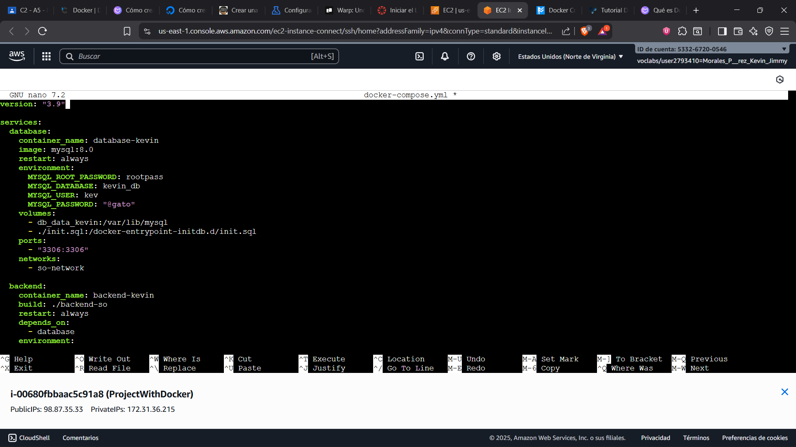
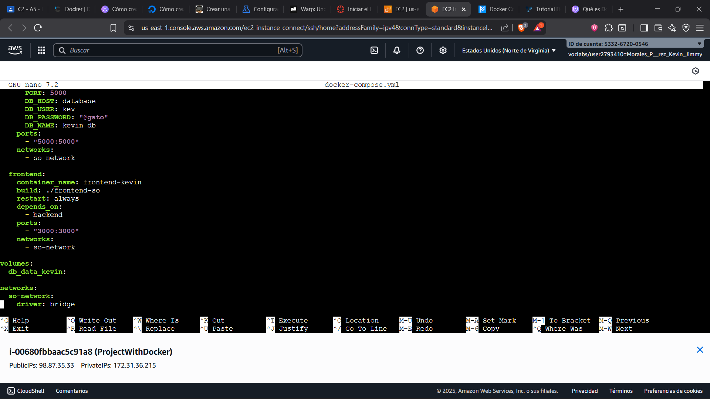
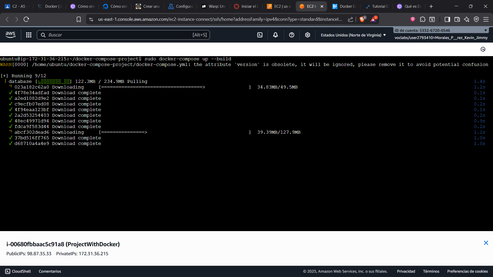
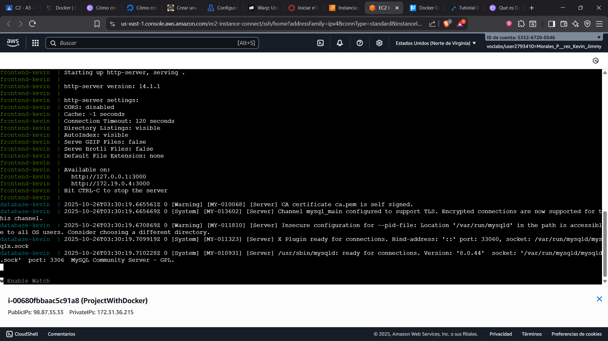
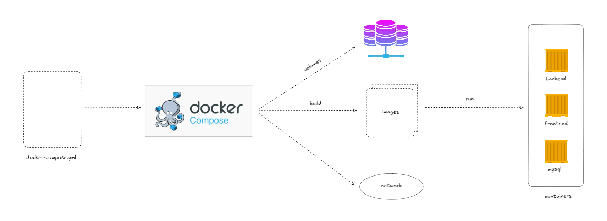

# Proyecto: backend-so

En el ámbito del desarrollo de software, la **eficiencia**, la **portabilidad** y la **simplicidad** son pilares fundamentales para el éxito de cualquier proyecto. En este contexto, **Docker Compose** se presenta como una herramienta esencial que facilita la gestión y orquestación de aplicaciones **multi-contenedor** de manera sencilla y reproducible.

---

## Definición de Docker Compose

**Docker Compose** es una herramienta que permite definir y ejecutar aplicaciones compuestas por múltiples contenedores mediante un único archivo de configuración llamado `docker-compose.yml`.  

Con un solo comando (`docker-compose up --build`), puedes construir, levantar y conectar todos los servicios necesarios para tu aplicación, garantizando entornos consistentes en desarrollo, pruebas y producción.

---

## Diferencia entre Docker y Docker Compose

| Herramienta | Descripción |
|--------------|-------------|
| **Docker** | Es la plataforma base que permite crear, ejecutar y distribuir aplicaciones dentro de **contenedores aislados**, incluyendo su código, dependencias y entorno de ejecución. |
| **Docker Compose** | Es una herramienta complementaria que permite **orquestar múltiples contenedores** (por ejemplo: backend, frontend y base de datos) desde un solo archivo YAML, facilitando su ejecución conjunta. |

> En resumen, **Docker** ejecuta contenedores individuales, mientras que **Docker Compose** los coordina como un sistema completo.

---

## Servicios del Proyecto

Este proyecto utiliza **Docker** y **Docker Compose** para crear un entorno compuesto por **tres servicios principales**:

| Servicio  | Imagen base | Puerto | Descripción |
|------------|-------------|--------|--------------|
| **Backend** | `node:22` | `5000` | API REST desarrollada en Node.js. Gestiona la lógica del negocio y se comunica con la base de datos MySQL. |
| **Frontend** | `node:22` + `http-server` | `3000` | Aplicación Angular que consume los endpoints del backend y muestra la interfaz de usuario. |
| **Base de Datos (MySQL)** | `mysql:8.0` | `3306` | Contenedor que almacena la información persistente del sistema. Se inicializa con credenciales y una base de datos predeterminada. |

---

## Requisitos Previos

Antes de ejecutar el entorno, asegúrate de tener instaladas las siguientes herramientas:

- [Docker Engine](https://docs.docker.com/engine/install/ubuntu/)
- [Docker Compose](https://imaginaformacion.com/tutoriales/que-es-docker-compose)

Verifica su instalación con:

```bash
docker --version
docker-compose --version
```

---

## Estructura del Proyecto

La estructura general del proyecto es la siguiente:

```
docker-compose-project/
│
├── frontend/
│   ├── Dockerfile
│   ├── .dockerignore
│   └── ... archivos del frontend (Angular)
│
├── backend/
│   ├── Dockerfile
│   ├── .dockerignore
│   └── ... archivos del backend (Node.js)
│
├── docker-compose.yml
```

> Cada servicio posee su propio `Dockerfile` personalizado según la tecnología que utiliza.

---

## Archivo `docker-compose.yml`

El archivo `docker-compose.yml` define los tres servicios, sus dependencias, redes y volúmenes.  
A modo de ejemplo, su estructura es la siguiente:

  


Cada servicio se comunica a través de una **red interna** creada automáticamente por Docker Compose, lo que permite usar los nombres de servicio como host (por ejemplo, `backend` o `db`).

---

## Cómo Levantar el Entorno

Para construir y ejecutar todos los servicios, abre una terminal en el directorio raíz del proyecto y ejecuta:

```bash
sudo docker-compose up --build
```




Si todo está correctamente configurado, verás los logs de los tres servicios levantándose en orden: **base de datos → backend → frontend**.

### En caso de error

Si necesitas reiniciar todo desde cero, ejecuta:

```bash
sudo docker-compose down
sudo docker-compose up --build
```

Esto eliminará los contenedores antiguos y reconstruirá todo el entorno desde cero.

---

## Comunicación entre Contenedores

La comunicación entre los contenedores se realiza mediante una **red interna de Docker Compose**:

- El **backend** accede a la base de datos usando el host `db` (no `localhost`).
- El **frontend** se comunica con el backend usando:
  - `http://localhost:5000` → cuando accedes desde tu navegador local.
  - `http://backend:5000` → cuando ambos servicios corren dentro de la red de Docker.

### Diagrama de comunicación

```
[Frontend] ---> [Backend] ---> [Base de Datos MySQL]
    |               |                 |
 puerto 3000     puerto 5000       puerto 3306
```

---

## Arquitectura General
## Descripción General

Este proyecto utiliza **Docker Compose** para orquestar una aplicación compuesta por tres servicios principales:

- **Frontend:** Aplicación web desarrollada con **Angular**.  
- **Backend:** API REST desarrollada con **Node.js** y **Express**.  
- **Base de Datos:** Servidor **MySQL** utilizado para la persistencia de datos.

Docker Compose permite levantar estos servicios de forma conjunta, gestionando sus imágenes, contenedores, redes y volúmenes de manera automatizada.

---

## Flujo del Sistema



---

## Flujo del Sistema

1.  **Inicialización del entorno con Docker Compose**

    Al ejecutar el siguiente comando:

    ```bash
    sudo docker-compose up --build
    ```

    Docker Compose lee la configuración del archivo `docker-compose.yml` y realiza las siguientes tareas:

    * Construye las imágenes de cada servicio.
    * Crea los contenedores correspondientes (frontend, backend y base de datos).
    * Define los volúmenes necesarios para la persistencia de la base de datos.
    * Configura la red interna que permite la comunicación entre los contenedores.

2.  **Interacción del usuario**

    El usuario accede a la aplicación a través del frontend (Angular) desde su navegador.

3.  **Comunicación frontend-backend**

    El frontend envía peticiones HTTP al backend (Node.js/Express) mediante las rutas expuestas por la API.

4.  **Procesamiento en el backend**

    El backend ejecuta la lógica de negocio, valida la información recibida y realiza las consultas necesarias a la base de datos MySQL.

5.  **Persistencia y respuesta**

    La base de datos almacena los datos y devuelve los resultados solicitados al backend, el cual los reenvía al frontend para su visualización en la interfaz del usuario.

---

## Conclusión

El uso de **Docker Compose** permite desplegar aplicaciones completas con un solo comando, garantizando entornos idénticos entre desarrollo y producción.  
En este proyecto, **backend**, **frontend** y **base de datos** trabajan de forma integrada, aislada y automatizada, demostrando las ventajas de la **contenedorización moderna** y la **orquestación de servicios**.

---

### Referencias

- «Ubuntu». (2025, 10 octubre). *Docker Documentation*. https://docs.docker.com/engine/install/ubuntu/
- Juell, K. (2019, 5 diciembre). *Cómo crear una aplicación Node.js con Docker*. DigitalOcean. https://www.digitalocean.com/community/tutorials/como-crear-una-aplicacion-node-js-con-docker-es
- Atareao. (2021, 10 agosto). *Crear una imagen Docker desde cero y paso a paso*. Atareao con Linux. https://atareao.es/tutorial/docker/crear-una-imagen-docker-desde-cero-y-paso-a-paso/
- De Imagina, E. (2025, 26 octubre). *Cómo crear imágenes personalizadas en Docker*. Imagina Formación. https://imaginaformacion.com/tutoriales/imagenes-personalizadas-docker
- De Imagina, E. (2025, 26 octubre). *Qué es Docker Compose y cómo usarlo | Tutorial completo*. Imagina Formación. https://imaginaformacion.com/tutoriales/que-es-docker-compose
- Fernández, A. (s. f.). *Tutorial Docker Compose*. https://anderfernandez.com/blog/tutorial-docker-compose/
- *Docker Compose versioning (Español)*. (s. f.). https://runebook.dev/es/docs/docker/compose/compose-file/compose-versioning/index#version-3
- *Labex.io (s. f.)*. https://labex.io/es/tutorials/docker-how-to-configure-docker-workdir-in-containers-392931
